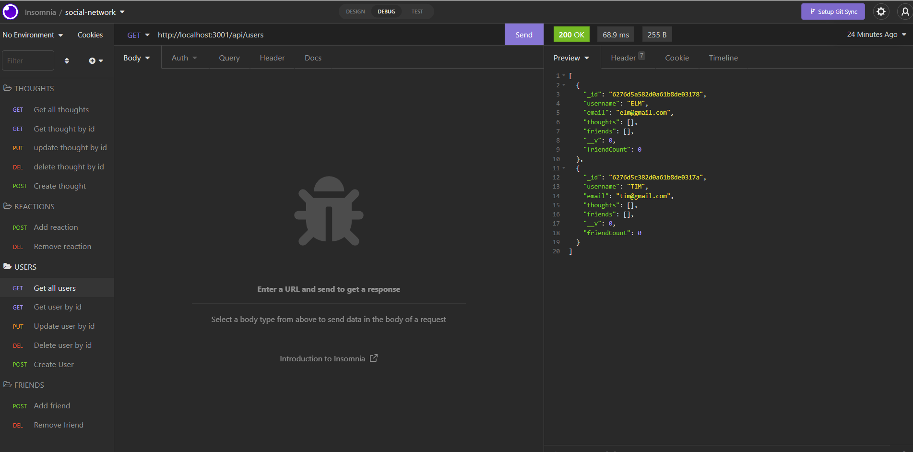

# social-network-api

## Description
API for social network application where the user can interact and share their thoughts. Built with express.js for routing, a MongoDB database, and the Mongoose ODM.

## Installation
- MongoDB
- Mongoose
- Express
- Node
- Nodemon

## Usage
1. Run `npm install`. 
2. Run `npm start` on index.js file to start the application.

## Visual

## Contact / Questions
 - [Email](erlmitchell@gmail.com)
 - [GitHub](https://github.com/ericaLorraineMitchell/social-network-api)